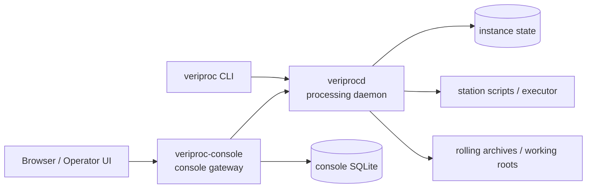

# VeriProc

VeriProc is a workflow engine for station-based processing pipelines. It runs processing tasks for configured stations, prepares station working directories and job orders, launches execution through a pluggable executor, tracks runs and artifacts, and routes downstream work based on processing results.

The repository contains:

- `veriprocd`: the daemon exposing the HTTP API and coordinating processing
- `veriproc`: the CLI used to submit, inspect, and operate tasks and runs
- local sandbox profiles for end-to-end development and demonstration

## Architecture



## Core Features

- Station-oriented task processing with structured task, run, and artifact tracking
- Configurable execution backends, including a local executor and SLURM integration
- Input resolution and publication against rolling archives
- Downstream routing, retries, and split/fan-out style workflows
- HTTP API, CLI tooling, and an operator web console
- SQLite-backed local deployments for development and lightweight environments

## Prerequisites

- Go toolchain
- Python 3 if you want to create a user-local virtual environment for frontend tooling
- Node.js 18+ and npm for building the operator webapp

If you do not have system administrator access, you can either use the pre-staged Node.js copy in `.tools/node/bin` or install Node.js inside a Python virtualenv with `nodeenv`.

## Local Deployment Example

For a simple local deployment, build the daemon, CLI, and console gateway from the repository root:

```bash
make build
```

Start an instance daemon with an example configuration:

```bash
mkdir -p sandbox/data
./bin/veriprocd --config sandbox/instance.yaml
```

In another terminal, point the CLI at the daemon:

```bash
export VERIPROC_API_URL="http://localhost:8080"
export VERIPROC_OUTPUT="table"
```

This gives you a complete local instance with a filesystem-backed archive layout, SQLite state, and locally executed station scripts.

## Operator Web Console

The web console is served by a separate `veriproc-console` gateway process. It polls one or more upstream `veriprocd` instances and serves the built frontend bundle from `webapp/dist`.

Build the frontend with a system Node.js installation or the repo-provided local toolchain:

```bash
export PATH="$PWD/.tools/node/bin:$PATH"
make webapp-install webapp-build
```

If you do not have Node.js on the system and want a user-local setup inside a Python virtualenv, one workable example is:

```bash
python3 -m venv .venv
. .venv/bin/activate
python -m pip install --upgrade pip nodeenv
nodeenv -p --node=20.11.1
cd webapp
npm install --no-fund --no-audit
npm run build
cd ..
```

After the frontend is built, start the console gateway:

```bash
./bin/veriproc-console --config sandbox-console/console.yaml
```

The sandbox console configuration serves the UI on `http://127.0.0.1:8090/` and points `webapp_dir` at `webapp/dist`.

## Operating VeriProc

Typical day-to-day operations use the CLI against a running daemon:

```bash
./bin/veriproc submit --station statA --start 2025-07-03T11:00:00Z --end 2025-07-03T11:15:00Z
./bin/veriproc task list
./bin/veriproc run list --task <task-id>
./bin/veriproc run get <run-id>
./bin/veriproc logs <run-id>
```

The operator web console can be deployed alongside the daemon for browsing instance state, station health, tasks, runs, and runtime details from a browser.

## Sandboxes

For concrete local examples, see the provided sandbox profiles:

- `sandbox/` for the main local developer profile
- `sandbox1/` for an additional local instance profile
- `sandbox-console/` for a ready-to-run operator web console profile

These directories include ready-to-run instance configuration, station fixtures, and archive layout examples. They are the best starting point if you want to understand how to structure an instance configuration and operate VeriProc locally.

## More Detail

See the documents under `docs/specs/` for the system architecture, API, CLI, and operator console specification.
