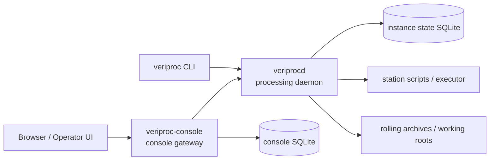

# 1. Overview

VeriProc is a lightweight **orchestration system for satellite Earth Observation (EO)
processing pipelines**. It is a workflow engine that runs processing tasks for configured
stations, prepares isolated working directories and job orders, launches execution
through a pluggable executor, tracks runs and artifacts with provenance, and routes
downstream work based on processing results.

It is inspired by NASA's S4P model of simple, file-driven stations, but replaces station
daemons, token files, and loosely defined control flow with a **REST API**, **declarative
YAML configuration**, **explicit persistence**, and **ephemeral executor jobs**.

## 1.1 What problem it solves

EO processing chains are graphs of algorithms ("stations") that consume products and
auxiliary data over a time window and produce new products, which in turn feed downstream
stations. Running these reliably requires more than launching scripts: you need stable
identity, input selection against rolling archives, deduplication that is *scientifically*
safe, recovery after crashes, provenance, and fan-out/fan-in for split processing.

VeriProc provides exactly that control plane while staying out of the science code's way.

**Core principle — separate orchestration from science code.** The backend owns routing,
identity, persistence, deduplication, rolling-archive interaction, and recovery. A station
algorithm receives only a generated **job order** and a dedicated **working root**, and
produces artifacts inside that directory. The algorithm never needs to know about the REST
API, the task graph, the scheduler protocol, or the state store.

## 1.2 Who it is for

- **Pipeline operators** who submit and monitor processing, retry failures, and clean up.
- **Integrators** who onboard a new station algorithm by writing a station YAML file.
- **Platform engineers** who deploy the daemon and console into cloud or hybrid-HPC
  environments with a shared filesystem.

## 1.3 The three binaries

VeriProc ships as three programs built from this repository:

| Binary | Role | Default port |
|--------|------|--------------|
| `veriprocd` | Processing daemon: REST API + orchestration loop (dispatch, poll, finalize, route) | 8080 |
| `veriproc` | CLI client: a thin HTTP client over the v1 REST API | — |
| `veriproc-console` | Operator web console gateway: polls one or more `veriprocd` instances and serves the web UI | 8090 |



The CLI and the console are both *clients* of the daemon. The daemon is authoritative for
control state; the shared filesystem is authoritative for artifact bytes.

## 1.4 Key features (this version)

- **Station-oriented task processing** with structured task, run, job, and artifact
  tracking, each with a stable identity.
- **Deterministic job-order generation** from task + station revision + resolved inputs,
  with `yaml`, `toml`, `json`, or `none` output and a built-in template renderer.
- **Input resolution and publication** against named **rolling archives** using ordered
  product categories and classical filename/time-window matching.
- **Scientifically safe deduplication** via a **processing fingerprint** that distinguishes
  *canonical*, *duplicate*, and *forced* runs.
- **Pluggable executors**: `local` and `stub` for development, `slurm-native` and
  `slurm-docker` for distributed HPC execution.
- **Downstream routing, retries, and split/fan-out workflows** with explicit group
  semantics for fan-in aggregation.
- **HTTP API, CLI tooling, and an operator web console** for browsing instance state,
  station health, tasks, runs, and run trees.
- **SQLite-backed local deployments** for development and lightweight environments
  (with a database-agnostic store facade designed for other backends).
- **Recovery & reconciliation**: durable state survives daemon restart without
  duplicating canonical work; a reconciler recovers stale runs.
- **Authentication & quotas**: bearer-token auth with `viewer`/`operator` roles and
  optional per-principal rate limits.

## 1.5 A 60-second tour

```bash
# 1. Build everything
make build

# 2. Start a daemon against the bundled sandbox profile
mkdir -p sandbox/data
./bin/veriprocd --config sandbox/instance.yaml

# 3. In another shell, talk to it with the CLI
export VERIPROC_API_URL="http://localhost:8080"
export VERIPROC_OUTPUT="table"

./bin/veriproc submit --station scen-clim \
    --start 2025-07-03T11:00:00Z --end 2025-07-03T11:15:00Z
./bin/veriproc task list
./bin/veriproc run list
./bin/veriproc logs <run-ref>
```

The sandbox gives you a complete local instance: filesystem-backed rolling archives,
SQLite state, and locally executed station scripts. See
[Installation & Build](04-installation-build.md) and the bundled `sandbox/` profile to go
further.

## 1.6 Status of this documentation

This documentation reflects the implemented feature set in the current development version
(`0.5-dev` line). Capabilities are grouped in the source by milestone (M0–M7); this guide
describes them as a single shipped system rather than per milestone. For the design
rationale and normative requirements, cross-reference [`docs/specs/`](../specs/).
