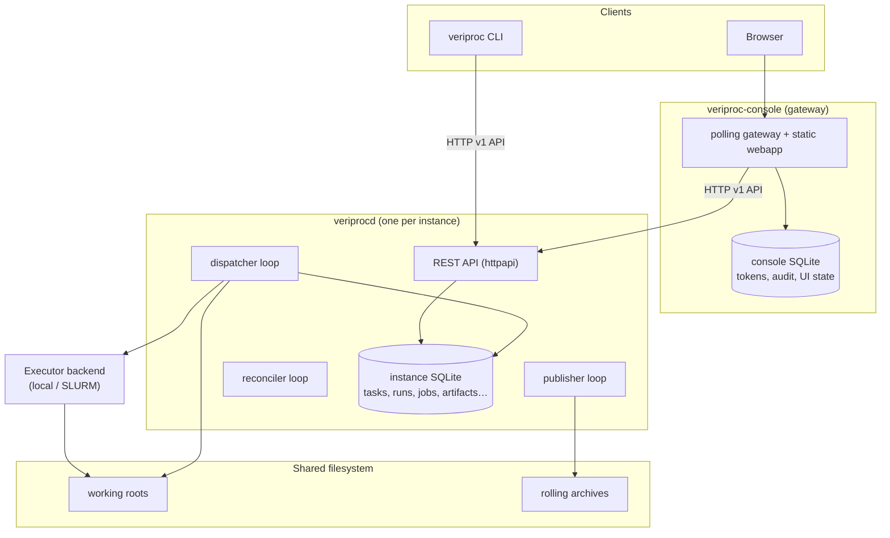
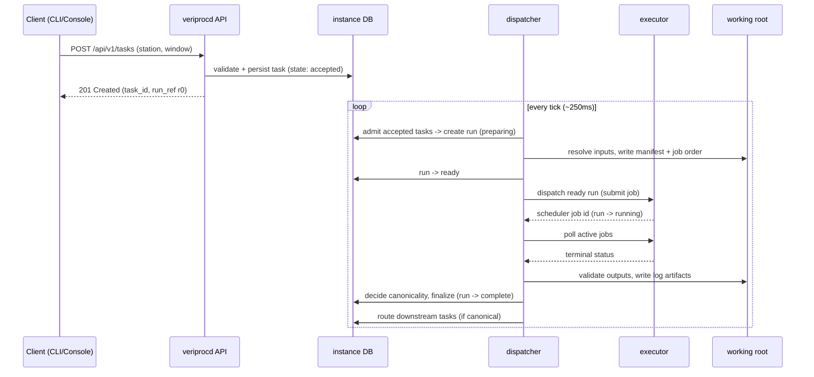

# 2. Architecture

This page explains how VeriProc is structured, how data flows through it, and how the Go
packages map onto responsibilities.

## 2.1 Components

VeriProc has three deployable components and two kinds of durable storage.

- **`veriprocd`** is one instance of the control plane. It exposes the REST API and runs
  three background loops: the **dispatcher** (admit → dispatch → poll → finalize), the
  **publisher** (push validated outputs to rolling archives), and the **reconciler**
  (recover stale runs).
- **`veriproc-console`** is an independent gateway. One console can front *several*
  upstream `veriprocd` instances. It keeps its own small SQLite database for console
  tokens, audit, and UI state, and serves the pre-built web bundle.
- **`veriproc` CLI** is stateless: every state-changing operation goes through the API.

## 2.2 Authoritative records

VeriProc deliberately splits authority between two stores:

| Concern | Authority |
|---------|-----------|
| Control state (tasks, runs, jobs, manifests, fingerprints, provenance) | The instance database (SQLite) inside `veriprocd` |
| Artifact bytes (job orders, inputs, outputs, logs) | The shared filesystem (working roots and rolling archives) |

This separation is what makes recovery tractable: the database can be replayed and
reconciled against the filesystem, and the filesystem holds the durable, science-relevant
bytes.

## 2.3 Request and processing flow

A task moves from submission to completion through the dispatcher's four-phase loop.

The detailed state machine and the input → manifest → job-order → dispatch pipeline are
described in [Concepts & Lifecycle](03-concepts.md).

## 2.4 Package map

The daemon and CLI are implemented under `internal/`. The table maps each package to its
responsibility so you can navigate the source.

| Package | Responsibility |
|---------|----------------|
| `internal/config` | Load and validate `instance.yaml`; defaults < file < env < flags precedence |
| `internal/policy` | Declarative naming (task IDs, working-root templates, filenames) and integrity (checksums) policy |
| `internal/store` | Database-agnostic persistence facade over SQLite; repositories for every aggregate; migrations |
| `internal/stations` | In-memory station registry, filesystem loader, and context-reference resolution |
| `internal/tasks` | Task intake, validation, idempotency, and query |
| `internal/runs` | Core orchestration: prepare, dispatch, poll, finalize, cancel, promote, retry, downstream routing, and the dispatcher loop |
| `internal/groups` | Split-group (fan-out/fan-in) coordination and aggregation |
| `internal/executor` | Executor interface and implementations: `stub`, `local`, `slurm-native`, `slurm-docker`; registry |
| `internal/publisher` | Asynchronous publication of validated outputs to rolling archives |
| `internal/reconciler` | Periodic recovery of stale runs using executor exit markers |
| `internal/cleaner` | Deletion of tasks/runs with working-root cleanup; filtered maintenance clean |
| `internal/fileops` | Safe artifact publication primitives (atomic copy/move, symlink, directory copy) |
| `internal/canonjson` | Deterministic, key-sorted JSON used for fingerprint hashing |
| `internal/auth` | Bearer-token authentication, `viewer`/`operator` roles, per-principal quotas |
| `internal/health` | Liveness/readiness aggregation for probes |
| `internal/httpapi` | REST handlers, routing, auth middleware, normalized error envelope |
| `internal/logging` | Structured logging (zerolog) with correlation IDs and console/json formats |
| `internal/console` | Operator console gateway: upstream polling, dashboard aggregation, static serving |
| `internal/version` | Build-time version metadata (version, commit, build date, API version) |

The three `main` packages live under `cmd/`: `cmd/veriprocd`, `cmd/veriproc`, and
`cmd/veriproc-console`.

## 2.5 Technology

- **Language:** Go (module `github.com/eum/veriproc`).
- **Persistence:** `modernc.org/sqlite` (pure-Go SQLite, no cgo). The store opens with
  foreign keys and WAL enabled, a single writer connection, and a busy timeout. The store
  is a facade designed so other backends can be added without changing callers.
- **Logging:** `zerolog`.
- **Config & data formats:** `gopkg.in/yaml.v3`; canonical JSON for fingerprints.
- **IDs:** `github.com/google/uuid` for internal identities.
- **Frontend:** a Preact bundle built with Vite under `webapp/`, served by the console.

## 2.6 Design intent in one paragraph

The control-plane contract (task → run → job → job order → working root) is stable across
execution backends and deployment sizes. Everything output-affecting is captured in a
processing fingerprint so deduplication is safe. Each run is isolated in its own working
root and driven only through a generated job order. State is durable and reconcilable, so
a crash never duplicates canonical work. These properties — determinism, isolation,
durable recovery, safe deduplication, explicit provenance, and executor portability — are
the load-bearing ideas; the rest of the system serves them.
