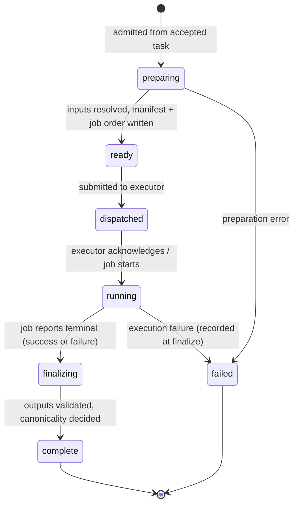
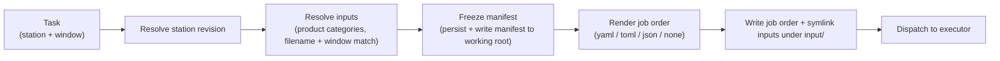

# 3. Concepts & Lifecycle

This page defines the domain model and the run state machine. Understanding these terms is
the key to operating VeriProc and reading its API responses.

## 3.1 Domain entities

| Entity | Meaning |
|--------|---------|
| **Station** | A configured processing algorithm with declared inputs, outputs, execution mode, and downstream routing. Defined by a YAML file; tracked as immutable **revisions** identified by a content hash. |
| **Task** | A request to process a defined time **window** at a destination station. The unit of routing identity. |
| **Run** | A single execution **attempt** for a task (retry index `r0`, `r1`, …). The unit of execution identity. |
| **Job** | The concrete scheduler submission that carries out a run (e.g. a SLURM job or a local process). |
| **Working root** | The dedicated directory for a run: generated job order, resolved inputs (as symlinks under `input/`), outputs, the task-output descriptor, and logs. |
| **Manifest** | The frozen record of which input objects were selected for a run, with their metadata. |
| **Artifact** | A tracked output or log with a logical identity and a physical location, optionally validated and published. |
| **Rolling archive** | A configured read-write directory used as an input source and, where station policy allows, a publication target for outputs. |
| **Processing fingerprint** | A hash of the scientifically relevant execution context, used for deduplication. The unit of processing identity. |
| **Split group** | A coordination object for fan-out/fan-in (split-window) processing. |

### Three kinds of identity

VeriProc deliberately distinguishes:

- **Routing identity** — the task (what to process, where to send it next).
- **Execution identity** — the run/job (one attempt and its scheduler submission).
- **Processing identity** — the fingerprint (what scientifically distinct work was done).

Keeping these separate is what makes retries, deduplication, and provenance well defined.

## 3.2 Identifiers

- **Task ID** encodes the station and a timestamp, e.g.
  `scen2-20250703T110000000-a7sf7f`. The timestamp source is configurable
  (`naming.task_id_timestamp`: `start` of the window, or task `creation` time) plus a
  short random suffix for uniqueness.
- **Run reference (`run_ref`)** is `"<task_id>/r<retry_index>"`, e.g.
  `scen2-20250703T110000000-a7sf7f/r0`. The CLI accepts this form wherever a run is
  expected.
- **Working-root path** is generated from `naming.working_root` templates (see
  [Configuration](05-configuration.md)).

## 3.3 Task states

A task is `accepted` when it passes validation and is persisted. The dispatcher then drives
it through runs. Task-level completion is recorded via its canonical run (`completed_at`,
`canonical_run_id`, `latest_run_id`).

## 3.4 Run state machine

A run progresses through the following states (terminal states in bold):

The validated lifecycle in the store is
`preparing → ready → dispatched → running → finalizing → complete`, with conditional
transitions so a crash cannot skip or repeat a step. Cancellation and reconciliation feed
into the same machine (see [Operations](11-operations.md)).

## 3.5 The dispatcher loop

`veriprocd` runs a dispatcher with a base tick interval of ≈250 ms that performs four
phases each tick:

1. **Admit** — turn `accepted` tasks that have no run yet into runs in `preparing`.
2. **Dispatch** — submit `ready` runs to their executor (station pause state is
   resolved with one batched query per tick, not per run).
3. **Poll** — query executor status for active jobs.
4. **Finalize** — complete runs whose jobs have reached a terminal state.

Each phase is idempotent and guarded so concurrent ticks and restarts are safe.

The tick interval is **adaptive**: when a tick finds no work in any phase, the next
interval doubles (up to a ceiling of 20× the base interval, i.e. 5 s at the default
250 ms base). Any tick that performs work resets the interval to the base value. This
keeps dispatch latency at the base interval under load while reducing idle CPU
consumption to near zero — important when the state store is SQLite on a network
filesystem, where even read-only queries are comparatively expensive.

## 3.6 From task to job order

When a run is prepared and dispatched, the backend builds the execution context
deterministically:

1. **Resolve station revision** by `station_id`.
2. **Resolve inputs** — for each declared input, scan the configured `product_categories`
   folder lists in order and select objects by filename pattern and time-window overlap.
3. **Freeze the manifest** — persist the selected inputs and write a manifest into the
   working root. This freezes the input selection for the run.
4. **Render the job order** — inject the resolved station context (instance `definitions`,
   `execution_env`, station config), resolve context references, and emit the configured
   format. `none` means no job-order file is generated.
5. **Lay out the working root** — write the job order, symlink resolved inputs under
   `input/`, and prepare output/log locations.

The generated job order (or the explicit `none` contract plus manifest and execution
arguments) **freezes the execution context** before dispatch.

## 3.7 Finalization and canonicality

When a job reaches a terminal state, the finalize phase:

1. Writes log artifacts and persists run metadata.
2. Validates outputs found in the working root.
3. Computes the **processing fingerprint** and decides canonicality.
4. Updates the task's `latest_run_id` and, if canonical, `canonical_run_id`.
5. Triggers downstream routing if the run is canonical.

### Canonicality values

| Value | Meaning |
|-------|---------|
| `canonical` | The first completed run to claim this processing fingerprint. Drives downstream routing. |
| `duplicate` | A later run whose fingerprint was already claimed. Recorded for audit; does **not** route downstream. |
| `forced` | The task carried the `force` flag. Always runs, never canonical — used for replays/diagnostics. |

## 3.8 Processing fingerprint

The fingerprint is a SHA-256 over a canonical (key-sorted) JSON encoding of the
output-affecting context, which includes:

- the **station revision** identity,
- the **resolved input manifest**,
- the **processing window** (start, end),
- the **task identity** and the (non-forced) **force flag**,
- any additional fingerprint context contributed by the run.

Two completed runs may be considered duplicates **only if their fingerprints are equal**.
Reprocessing with changed inputs, auxiliary files, station revision, or algorithm image
yields a distinct fingerprint — so deduplication never hides scientifically different
work.

## 3.9 Provenance

VeriProc keeps both:

- a **human-readable routing history** carried with each task and written as a
  routing-history artifact, and
- **machine-queryable provenance links** (source → target) in the database.

Together these answer: which run produced an artifact, which inputs a run consumed, and the
parent/child relationships between upstream and downstream tasks.

## 3.10 Split (fan-out / fan-in) processing

A wide window can be split into sub-windows that are processed independently and then
aggregated. A **split group** coordinates this:

- Members register with a **role**: `contributing` (a fan-out member) or `aggregation`
  (the fan-in task).
- The group's state is **derived** from its members: `open`/`aggregating` while any member
  is active, `complete` when all members are terminal and at least one is canonical,
  `failed` when a member fails and none is canonical.

See [Operations](11-operations.md) for how to drive and close groups.

## 3.11 Idempotency vs. deduplication

These are two different mechanisms — do not confuse them:

- **Idempotency** (at task submission) deduplicates *client retries*. Re-submitting with
  the same `Idempotency-Key` and the same content returns the same task; the same key with
  different content is a conflict.
- **Deduplication** (at finalize) is about *scientific equivalence* via the processing
  fingerprint, deciding canonical vs. duplicate runs.
