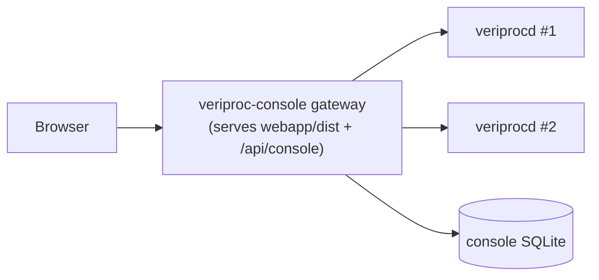

# 10. Operator Web Console

The operator console is a **separate gateway process** (`veriproc-console`) that polls one
or more upstream `veriprocd` instances and serves a browser UI. It is independent of any
single daemon: one console can front several deployments.



## 10.1 What it provides

- A dashboard aggregating tasks, runs, and station health across configured instances.
- Browsing of run trees and file previews within allow-listed filesystem roots.
- Its own authentication (`viewer`/`operator` tokens), independent of upstream daemons.
- A small SQLite database for console tokens, audit, and UI state.

## 10.2 Running it

Build the frontend first (see [Installation §4.3](04-installation-build.md)), then:

```bash
./bin/veriproc-console --config sandbox-console/console.yaml
# open http://127.0.0.1:8090/ and sign in with a configured token
```

### Flags

| Flag | Env | Default | Meaning |
|------|-----|---------|---------|
| `--config <path>` | `VERIPROC_CONSOLE_CONFIG` | — (required) | Console YAML config. |
| `--http-addr <addr>` | — | from config | Override `http.bind_addr`. |
| `--webapp-dir <path>` | `VERIPROC_CONSOLE_WEBAPP` | from config | Override the built-frontend directory. |
| `--log-level <level>` | — | `info` | trace\|debug\|info\|warn\|error. |

## 10.3 Configuration

```yaml
schema_version: veriproc.console/v1

http:
  bind_addr: 127.0.0.1:8090

ui:
  refresh_interval: 5s            # dashboard auto-refresh cadence
  visible_slot_count: 15          # number of live slots shown
  completed_visibility_timeout: 30s   # how long completed items linger
  default_stats_since: 24h        # default stats window
  upstream_summary_timeout: 30s   # timeout fetching an instance summary
  preview_max_bytes: 1048576      # max bytes served by file preview

db:
  dsn: file:sandbox-console/console.db   # console-scoped SQLite (schema auto-created)

auth:
  # Plaintext only for local use. The gateway stores SHA-256 hashes at
  # registration time; plaintext is never persisted.
  tokens:
    - { subject: viewer-demo,   role: viewer,   token: sandbox-viewer-token }
    - { subject: operator-demo, role: operator, token: sandbox-operator-token }

webapp_dir: webapp/dist            # built Preact bundle

instances:
  - id: sandbox1
    title: Sandbox1
    base_url: http://127.0.0.1:8080      # upstream veriprocd
    token: ""                            # bearer token for upstream (if it requires auth)
    upstream_timeout_ms: 10000
    working_root_base: sandbox1/data/working-roots
    allowed_roots:                       # filesystem containment for browsing/preview
      - sandbox1/data/working-roots
      - sandbox1/rolling-archives
```

### Config reference

| Section | Key | Meaning |
|---------|-----|---------|
| `http` | `bind_addr` | Address the console UI/API listens on. |
| `ui` | `refresh_interval` | How often the dashboard refreshes. |
| `ui` | `visible_slot_count` | Number of live processing slots displayed. |
| `ui` | `completed_visibility_timeout` | How long completed items stay visible. |
| `ui` | `default_stats_since` | Default statistics lookback window. |
| `ui` | `upstream_summary_timeout` | Per-instance summary fetch timeout. |
| `ui` | `preview_max_bytes` | Maximum file-preview size. |
| `db` | `dsn` | Console SQLite location (`file:<path>`). |
| `auth.tokens[]` | `subject` / `role` / `token` | Console login identities. Roles: `viewer`, `operator`. |
| `webapp_dir` | — | Directory of the built frontend bundle. |
| `instances[]` | `id` / `title` | Instance identity and display name. |
| `instances[]` | `base_url` | Upstream `veriprocd` URL. |
| `instances[]` | `token` | Bearer token used to call the upstream (if it requires auth). |
| `instances[]` | `upstream_timeout_ms` | Per-request timeout to the upstream. |
| `instances[]` | `working_root_base` | Base path for resolving run working roots in the UI. |
| `instances[]` | `allowed_roots` | Filesystem roots that may be browsed/previewed; resolved to absolute, symlink-checked paths at startup. |

## 10.4 Security notes

- **Token storage:** the gateway hashes tokens (SHA-256) at registration; plaintext from
  the config is never written to the database. Still, treat the config file as a secret and
  replace sandbox tokens for any non-local deployment.
- **Filesystem containment:** only paths under `allowed_roots` can be reached through the
  run-tree and file-preview endpoints. Symlinks are resolved and checked, so a symlink
  cannot escape the allow-list. Keep `allowed_roots` as narrow as possible.
- **Upstream auth:** when an upstream daemon enforces auth, give the instance an `operator`
  or `viewer` token via `instances[].token` as appropriate for the console's needs.

## 10.5 Console API surface

The gateway serves the static bundle plus a console API (e.g. dashboard aggregation,
instance listing, and per-instance proxy endpoints) under `/api/console`. The browser app
consumes these; you normally do not call them directly. Upstream calls honor each
instance's `upstream_timeout_ms`, so a slow or down instance degrades gracefully rather
than blocking the whole dashboard.
