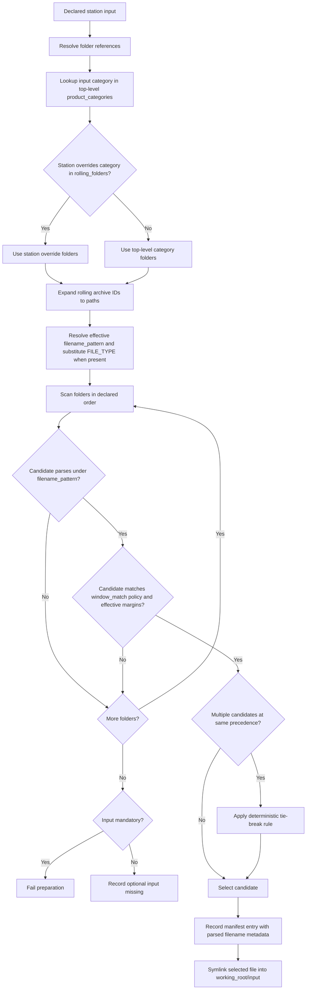
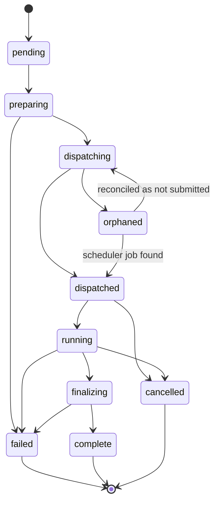
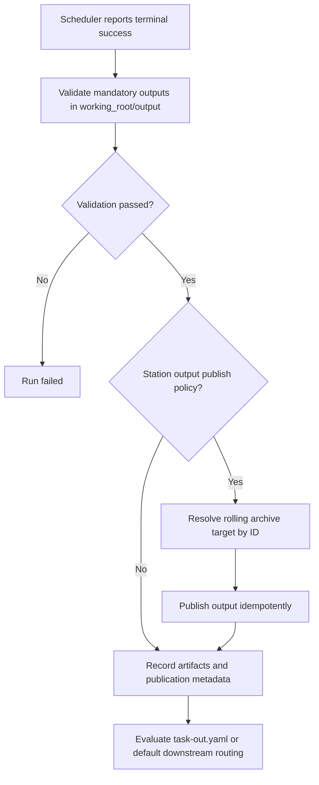
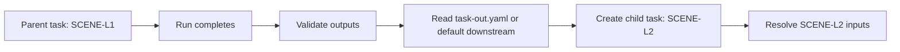
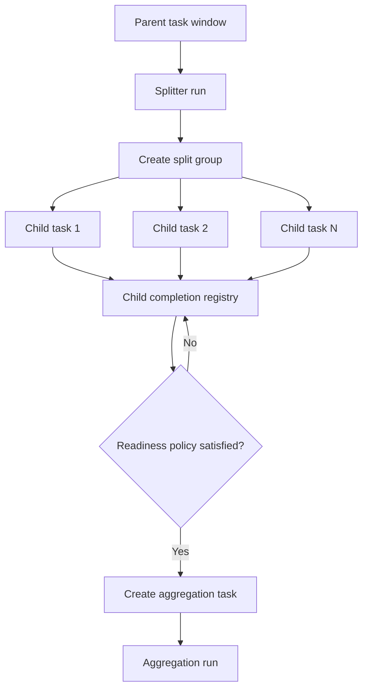

# 2. System Architecture Overview

VeriProc is organized into three architectural layers:

- The **control plane** accepts tasks, validates them, resolves inputs, generates job orders, dispatches jobs, validates outputs, creates downstream tasks, and serves the API.
- The **execution description layer** freezes the context of one run into a versioned job order plus a resolved input manifest.
- The **execution layer** translates a run into a concrete scheduler job and exposes enough status for the control plane to track completion.

The database is authoritative for control state. The shared filesystem is authoritative for artifact bytes. The scheduler is authoritative for job admission and runtime status. The science algorithm is authoritative only for files it writes inside the working root.

## 2.1 High-Level Components

| Component | Role | Normative responsibilities |
|---|---|---|
| **VeriProc Backend** | Control plane | Must validate submissions, persist task/run state, compute fingerprints, generate job orders, dispatch jobs, recover after restart, validate outputs, and create downstream tasks. |
| **State Store** | Durable control state | Must persist tasks, task relationships, runs, jobs, manifests, artifacts, split groups, and deduplication records. |
| **Execution Adapter** | Scheduler translation | Must submit, query, and if supported cancel jobs through a stable adapter contract. |
| **Shared Storage** | Artifact and working-root storage | Must hold working roots, logs, outputs, optional task-out descriptors, and symlinked input views. |
| **Station Configuration Store** | Declarative station definitions | Must provide versioned station revisions validated before use. |
| **Instance Configuration** | Deployment-level configuration | Must declare storage roots, naming and generated path policy, integrity policy, rolling archives, executor defaults, facility metadata, and optional custom generator modules. |
| **Rolling Archive** | Operational read-write data cache | Must provide configured directories used for input selection and optional post-run output publication with retention policy. |
| **Generation Hooks** | Customization extension points | May override system-default working-root path generation and job-order generation while preserving the same validation and recovery contracts. |
| **Client Frontends** | Submission and query clients | Must interact only through the API; they must not mutate backend state by writing directly into working roots. |

## 2.2 Authoritative Records

The following records are mandatory for a conforming implementation:

| Record | Authority | Notes |
|---|---|---|
| Task record | Database | Immutable routing request plus status summary |
| Task relationship record | Database | Parent-child task and provenance edges |
| Run record | Database | One execution attempt for one task |
| Job record | Database | Scheduler-facing record linked to one run |
| Station revision record | Database or versioned config store | Frozen configuration identity used by the run |
| Resolved input manifest | Database | Frozen input selection and metadata; an exported copy may also be written under the working root |
| Job order | Working root | Frozen execution descriptor consumed by the algorithm |
| Artifact record | Database | Logical and physical identity of produced files |
| Rolling archive definition | Instance configuration | Named archive directory, retention policy, and publication behavior |
| Rolling archive publication record | Database | Records output files copied or linked from a working root into an archive |
| Split-group record | Database | Fan-out/fan-in coordination state |
| Deduplication record | Database | Canonical completed fingerprint ownership |

The implementation may store some of these records redundantly in both the database and the working root, but the database must remain the system of record for query and recovery. A working-root copy of the resolved input manifest is an audit export and must not replace the database records required for manifest query and recovery.

## 2.3 Versioning Boundaries

The architecture must expose explicit version boundaries:

- Every station configuration must resolve to a **station revision**.
- Every generated job order must carry a **job order schema version**.
- Every custom generator module must carry an implementation identity or version.
- The API should expose an explicit API version.
- Database schema changes must follow an explicit migration policy.

If a run is created with station revision `R`, then later station edits must not retroactively change the meaning of that run.

## 2.3.1 Instance Configuration and Generation Hooks

The top-level VeriProc instance configuration defines deployment-specific roots and extension points. It is not a station definition. A conforming implementation must validate it before startup and must expose its effective identity for audit.

```yaml
schema_version: veriproc.instance/v1
instance_id: eum-prod

storage:
  working_root_base: /shared/veriproc/work
  station_config_root: /shared/veriproc/stations

naming:
  timestamp_format:
    task_window: compact-utc-millis
    runtime_event: compact-utc-micros
  working_root:
    station_segment: "{station_id}"
    task_segment: "task-{start}-{created}"
    run_segment: "run-{created}"
    collision_suffix: "-{short_run_id}"
  filenames:
    allowed_charset: "A-Z a-z 0-9 - _ ."
    replace_invalid: "_"
    max_segment_length: 128
    station_case: preserve
    filename_pattern: "<MISSION_ID>_<FILE_TYPE>_<START_TIME>_<END_TIME>_<GENERATION_TIME>_*"
    components:
      MISSION_ID:
        pattern: "CDM?"
        length: 4
        charset: ascii
      FILE_TYPE:
        length: 16
        charset: ascii
      START_TIME:
        format: "YYYYMMDDTHHmmSSZ"
        length: 16
      END_TIME:
        format: "YYYYMMDDTHHmmSSZ"
        length: 16
      GENERATION_TIME:
        format: "YYYYMMDDTHHmmSSZ"
        length: 16

integrity:
  checksum_policy: available_only
  allowed_algorithms: [sha256]
  record_size_when_available: true
  record_mtime_when_available: true

facility:
  processing_center: EUM
  environment: OPERATIONAL

rolling_archives:
  co2m_hot:
    path: /shared/rolling/co2m/hot
    retention: P14D
    mode: read_write
  aux_static:
    path: /shared/rolling/aux/static
    retention: P180D
    mode: read_write

product_categories:
  - name: product
    folders:
      - rolling:co2m_hot
  - name: aux
    folders:
      - rolling:aux_static

generators:
  working_root:
    type: python
    module: eum_veriproc_hooks.working_root:build_path
    version: 2026.05.01
  job_order:
    type: python
    module: eum_veriproc_hooks.job_order:render
    version: 2026.05.01
```

If no custom generator is configured, the system-default generators must be used. Custom generator modules must receive only validated inputs: task, run identity, station revision, resolved manifest, facility configuration, and instance storage settings. They must return deterministic results and must not mutate database state directly.

The top-level `naming` policy governs generated working-root path segments and any VeriProc-generated filenames or filename-adjacent segments. It must not create alternate durable identities. Generated path and filename segments must be deterministic for the validated input context, must use only the configured allowed character set after normalization, and must apply the configured replacement rule for unsafe characters. Implementations should enforce a maximum segment length, with `128` characters recommended unless deployment policy requires otherwise.

The top-level `naming.filenames.filename_pattern` defines the instance-wide structured filename contract for products handled by VeriProc. It is a parsing and rendering template, not only a glob. The pattern language must support at least the placeholders `<MISSION_ID>`, `<FILE_TYPE>`, `<START_TIME>`, `<END_TIME>`, and `<GENERATION_TIME>`, plus an unconstrained suffix or wildcard segment when needed. The placeholder vocabulary itself must remain available to station-level overrides.

The top-level instance configuration must also define the component rules for each supported placeholder under `naming.filenames.components`. These component rules are global for the instance and must define fixed semantics such as width, allowed character class, and timestamp format. For example, `MISSION_ID` may be declared as `CDM?`, where `?` means exactly one ASCII character, allowing concrete values such as `CDMA` or `CDMZ`. `FILE_TYPE` may be constrained to 16 ASCII characters. `START_TIME`, `END_TIME`, and `GENERATION_TIME` may be constrained to the fixed UTC shape `YYYYMMDDTHHmmSSZ`. Station-level definitions may override the overall `filename_pattern`, but they must not redefine the global component semantics.

If a station input or output definition declares its own `filename_pattern`, that station-local definition overrides the instance-wide default for that declared file type. When an effective pattern contains `<FILE_TYPE>`, VeriProc must substitute it from the declared input or output `file_type`; it must not infer `<FILE_TYPE>` from candidate discovery alone. During input selection and output validation, the backend must parse candidate filenames according to the effective pattern and extract the declared structured components for audit, deterministic matching, and later replay.

Structured-component extraction must use fixed positional extraction derived from the effective `filename_pattern` and the globally defined component rules. Implementations may internally compile this into helper code, tables, or regexes, but the externally visible behavior must be equivalent to fixed-width, position-based extraction rather than heuristic splitting.

Timestamp segments generated by VeriProc must use compact UTC formatting without punctuation. Task-window timestamps must not require more than millisecond precision, for example `20250703T101218019Z`. Runtime event timestamps such as run creation, preparation, dispatch observation, or finalization may use microsecond precision, for example `20260506T071500001234Z`. RFC 3339 timestamps may still be used in API payloads and persisted timestamp fields; compact timestamp formatting is for generated path segments, generated filenames, and CLI examples that display those generated names.

The top-level `integrity` policy governs checksum recording and computation for input manifests, artifacts, and publication metadata. The default checksum policy must be `available_only`, meaning the backend records checksums from sidecars, upstream metadata, or external metadata when already available, but must not read large files solely to compute checksums. A policy of `none` means checksums are neither required nor computed. A policy of `required` means checksums must exist or must be computed according to deployment or station policy before the relevant validation step succeeds. Manifest and artifact checksum fields remain optional unless policy explicitly requires them.

## 2.4 Task, Run, Job, and Job Order Relationship

The four similarly named concepts have distinct roles:

- A **task** is an immutable request to process a destination station over a time window.
- A **run** is one execution attempt for that task.
- A **job** is the scheduler submission that carries out that run.
- A **job order** is the immutable execution document generated for that run.

The required cardinality rules are:

- One task may have zero or more runs.
- One run must reference exactly one task.
- One run may have zero or one active scheduler jobs at a time.
- One job must reference exactly one run.
- One run must reference exactly one generated job order.

Retries must create new runs, not mutate the identity of an existing run.

## 2.5 Station Configuration Model

Stations are declared in YAML and must define enough information for scheduling, input resolution, output validation, and downstream routing.

At minimum, a station revision must include:

- `station_id`
- `proc_type`
- execution image and mode
- command template
- resource requirements
- category-folder overrides, if the station overrides top-level category defaults
- input definitions, including declared `file_type`, category, and any `filename_pattern` override or interval-matching policy needed for that input
- output definitions, including declared `file_type` and any `filename_pattern` override needed for validation or publication naming
- output publication policy, if outputs should be copied back to a rolling archive, including any explicit publication subpath below the archive root when required
- default downstream routing
- split-group policy, if station default downstream routing can create grouped fan-out/fan-in work
- any station-specific validation hooks or runtime parameters

The backend must validate station configurations before accepting them for dispatch. Invalid station revisions must not be used to create runs.

If a station revision can create a split group through default downstream routing, its configuration must define the grouped workflow policy deterministically. That policy must include the group evaluation mode, grouped evaluation target or stage, membership basis, child-key derivation or explicit child set rules, closure policy, readiness policy, failure and partial-aggregation behavior, and aggregation target and input-selection rules when aggregation is enabled.

If split-group metadata is emitted dynamically through `task-out.yaml`, the station configuration must define whether dynamic split declarations are allowed and which fallback or merge behavior applies when both `task-out.yaml` and default downstream routing are present.

### 2.5.1 Example `station.yaml`

The following example is informative, but illustrates the expected shape of station configuration. Archive references such as `rolling:co2m_hot` must resolve through the top-level instance configuration.

```yaml
schema_version: veriproc.station/v1
station_id: SCENE-L2
proc_type: SCE_2

execution:
  mode: apptainer
  image: /shared/images/scene-l2.sif
  command: "scenel2-proc --joborder {joborder} --working-root ${VERIPROC_WORKING_ROOT}"
  resources:
    cpu: 8
    mem_gb: 32
    walltime: PT2H

job_order:
  template: conf/joborder-scenel2.yaml

# override top-level rolling configuration if needed
rolling_folders:
  product:
    - rolling:co2m_hot
    - /shared/archive/co2m/products

inputs:
  - file_type: CO2_1A_GEO______
    category: product
    filename_pattern: "<MISSION_ID>_<FILE_TYPE>_<START_TIME>_<END_TIME>_<GENERATION_TIME>_*"
    window_match: overlaps
    mandatory: true
  - file_type: NO2_1B_RAD______
    category: product
    filename_pattern: "<MISSION_ID>_<FILE_TYPE>_<START_TIME>_<END_TIME>_<GENERATION_TIME>_*"
    window_match: overlaps
    mandatory: true
  - file_type: SCE_2__CNF____AX
    category: aux
    filename_pattern: "<MISSION_ID>_<FILE_TYPE>_<START_TIME>_<END_TIME>_<GENERATION_TIME>_*"
    window_match: covers_window
    mandatory: true
  - file_type: SCE_2__CAMF___AX
    category: aux
    filename_pattern: "<MISSION_ID>_<FILE_TYPE>_<START_TIME>_<END_TIME>_<GENERATION_TIME>_*"
    window_match: within_window
    mandatory: false

outputs:
  - file_type: SCE_2__CSM______
    filename_pattern: "<MISSION_ID>_<FILE_TYPE>_<START_TIME>_<END_TIME>_<GENERATION_TIME>_*.nc"
    mandatory: true
    publish:
      rolling_archive: co2m_hot
      mode: copy
      target_subpath: validated/scene-l2
  - file_type: SCE_2__ENG____AX
    filename_pattern: "<MISSION_ID>_<FILE_TYPE>_<START_TIME>_<END_TIME>_<GENERATION_TIME>_*.nc"
    mandatory: false

triggers:
  - type: dir_poll
    file_type: CO2_1A_GEO______
    folder: rolling:co2m_hot
    period: PT5M
  - type: upstream
    station_id: SCENE-L1

downstream:
  - station_id: SCENE-L3
    when: outputs.csm.present
```

## 2.6 Task Model and Submission Semantics

A task must contain, at minimum:

- a task identifier
- destination station identity, directly or through the `proc_type` prefix
- `start` and `end` timestamps
- routing history
- provenance links to its parent task or parent run when applicable

Task submission semantics must follow these rules:

- A task is immutable after creation except for backend-maintained status metadata.
- Task creation time such as `created_at` is task metadata, not part of the minimum routing window definition.
- Re-submitting the same client request with the same idempotency key must return the same logical result.
- Downstream tasks created by the framework are new domain objects, not mutable copies of the parent.
- Parent-child relationships must be persisted explicitly even if the task carries a readable history list.

### 2.6.1 Example task and routing history

```yaml
schema_version: veriproc.task/v1
task_id: task-20250703T111539000Z-20250703T115000000Z
idempotency_key: client-req-7f84d0
destination:
  station_id: SCENE-L2
window:
  start: "2025-07-03T11:15:39Z"
  end: "2025-07-03T11:30:00Z"
created_at: "2025-07-03T11:50:00Z"
priority: normal
force: false
parent:
  task_id: task-20250703T110000000Z-20250703T114832000Z
  run_id: run-019dfc19-1bbb-77e4-9e12-9c9d9957778f
history:
  - station_id: INGEST
    task_id: task-20250703T101500000Z-20250703T114110000Z
    completed_at: "2025-07-03T11:41:10Z"
    summary: "L1 source package registered"
  - station_id: SCENE-L1
    task_id: task-20250703T110000000Z-20250703T114832000Z
    run_id: run-019dfc19-1bbb-77e4-9e12-9c9d9957778f
    completed_at: "2025-07-03T11:48:32Z"
    summary: "L1 scene products generated"
client_metadata:
  mission: CO2M
  orbit_id: "20250703T111539"
```

## 2.7 Input Resolution Policy

Input resolution must be deterministic and auditable.

### 2.7.1 Selection rules

The backend must resolve inputs according to these rules:

1. Each declared input must specify a `category` and a `file_type`.
2. Candidate files must first satisfy the effective `filename_pattern` for that input. The effective pattern is the station-local `filename_pattern` when present, otherwise the instance-wide `naming.filenames.filename_pattern`.
3. If the effective pattern contains `<FILE_TYPE>`, VeriProc must substitute the declared input `file_type` before candidate scanning or validation.
4. Candidate filenames that satisfy the effective pattern must then be parsed into structured metadata using fixed positional extraction derived from the effective pattern and the globally configured component rules. At minimum, the backend must extract `mission_id`, `start_time`, `end_time`, and `generation_time`, plus `file_type` when the effective pattern contains `<FILE_TYPE>`.
5. The effective folder search order for an input must be taken from the matching top-level `product_categories` entry.
6. A station may override the top-level folder order for a category through `rolling_folders`.
7. Folder entries that reference `rolling:<archive_id>` must be resolved through instance configuration before scanning.
8. Resolved folder entries must preserve their declared order relative to literal filesystem paths.
9. Candidate interval matching must be evaluated against the effective processing window using the declared `window_match` policy for that input. Supported policies must include `overlaps`, `within_window`, and `covers_window`. Implementations may accept compatibility aliases such as `cross`, `fully_within`, and `surrender`, but the canonical specification names are `overlaps`, `within_window`, and `covers_window`.
10. If a station definition also declares time margins, those margins must expand the effective processing window before `window_match` evaluation.
11. If multiple candidates exist within the same effective precedence level after interval matching, the station or system policy must define a deterministic tie-break rule.
12. If no explicit tie-break rule is configured, the implementation must use a documented default that is stable across retries.

The default tie-break rule should be based on explicit version metadata if available. If no version metadata exists, the backend should fall back to a deterministic ordering derived from path, timestamp, and filename.

The canonical interval-matching semantics are as follows. `overlaps` matches any candidate whose parsed time interval intersects the effective processing window. `within_window` matches only candidates whose parsed time interval lies fully inside the effective processing window. `covers_window` matches only candidates whose parsed time interval fully contains the effective processing window.

Component extraction must enforce the global component definitions exactly. A `MISSION_ID` component configured as `CDM?` must match four ASCII characters whose first three positions are `C`, `D`, and `M`, and whose fourth position may be any ASCII character. A `FILE_TYPE` component configured with length `16` must consume exactly 16 ASCII characters at its declared position. Timestamp components configured as `YYYYMMDDTHHmmSSZ` must be parsed from exactly 16 characters and must be interpreted as UTC timestamps.

### 2.7.2 Recorded metadata

For each resolved or missing input, the manifest must record:

- file type
- category
- mandatory or optional status
- source path if resolved
- source directory precedence
- file size if resolved
- modification time if resolved
- checksum value, checksum algorithm, and checksum source if available under the instance integrity policy
- effective filename pattern
- applied `window_match` policy
- parsed mission identifier when resolved
- parsed start, end, and generation timestamps when resolved
- parsed file type when the effective pattern contains `<FILE_TYPE>`
- any version or revision metadata derived from filename or sidecar metadata
- the selection reason or tie-break outcome

### 2.7.3 Frozen execution context

The manifest must be frozen before dispatch. Once the run enters dispatching, the resolved input set must not change for that run.

### 2.7.4 Selection algorithm

The input selection algorithm must follow the same decision path for all declared inputs. The input's `category` determines which ordered folder list is searched.



## 2.8 Job Order Generation

The backend must generate a job order only after task validation, station revision resolution, and input manifest finalization succeed.

The generated job order must include, directly or by reference:

- station revision identity
- job order schema version
- run identity
- task identity
- processing window
- facility block
- root-level `log_level`
- root-level `dyn_params` containing algorithm-facing variable parameters controlled by station configuration and run context
- resolved input references pointing into `./input/`, where one input entry may reference one or several files for the same `file_type`
- expected output declarations
- optional reference to the persisted input manifest

The job order must be written to the working root before scheduler submission. If job order generation fails, no scheduler job may be submitted.

If a custom job-order generator is configured in the instance configuration, it may override template rendering. The custom generator must still produce a schema-valid job order, must not reference paths outside the working root, and must record its generator identity in the generated file or associated run metadata.

The default job-order model keeps `inputs` as one flat list keyed by unique `file_type` values. Inputs must not be split by category unless a station-specific schema explicitly requires it.

Within that flat list, each input entry represents one declared station input and may bind to one file or to several files. The default schema therefore uses a `files` field for each entry, even when only one file is present.

The runtime environment contract is separate from the job-order schema. Environment variables such as `VERIPROC_WORKING_ROOT` and `VERIPROC_JOBORDER_PATH` must be injected by the execution layer into the launched process, and station command templates may reference them directly.

### 2.8.1 Example generated `joborder.yaml`

```yaml
schema_version: veriproc.joborder/v1
joborder_id: joborder-019dfc19-2004-77e4-a349-1c3e736db9ac
task_id: task-20250703T111539000Z-20250703T115000000Z
run_id: run-019dfc19-2000-77e4-b865-b74d3a89c311
station:
  station_id: SCENE-L2
  revision: sha256:4df5c9f1b5d8
generator:
  type: custom
  name: eum_veriproc_hooks.job_order:render
  version: 2026.05.01
order:
  start: "2025-07-03T11:15:39Z"
  end: "2025-07-03T11:30:00Z"
facility:
  acquisition_station: Svalbard
  processing_center: EUM
  environment: OPERATIONAL
log_level: DEBUG
dyn_params:
  mode: NOMINAL
  CpuCores: 8
manifest:
  path: ./manifest/resolved-inputs.yaml
inputs:
  - file_type: CO2_1A_GEO______
    files:
      - ./input/CDMA_CO2_1A_GEO_______ON_20250703T111239_20250703T111539_20251101T000002_018_093_EUM__VAL_T_NR_C00.nc
  - file_type: NO2_1B_RAD______
    files:
      - ./input/CDMA_NO2_1B_RAD_______ON_20250703T111239_20250703T111539_20251101T000002_018_093_EUM__VAL_T_NR_C00.nc
      - ./input/CDMA_NO2_1B_RAD_______ON_20250703T111539_20250703T111839_20251101T000002_018_093_EUM__VAL_T_NR_C00.nc
  - file_type: SCE_2__CNF____AX
    files:
      - ./input/CDMA_SCE_2__CNF____AX____20250101T000000_20991231T235959_20251101T000000_________EUM__VAL_T_NR_000.CDM
outputs:
  - file_type: SCE_2__CSM______
    directory: ./output
    mandatory: true
  - file_type: SCE_2__ENG____AX
    directory: ./output
    mandatory: false
```

## 2.9 Working Root Contract

For each run, the backend must create a dedicated working root at a deterministic path, for example:

```text
<working_root_base>/<station_segment>/<task_segment>/<run_segment>/
```

With the example naming policy in Section 2.3.1, a generated path may look like:

```text
/shared/veriproc/work/STATION-A/task-20250703T101218019Z-20250703T101318019Z/run-20260506T071500001234Z
```

The working-root path is not the run identity. The run identity remains `run_id` and is the only durable identifier used for persistence, foreign keys, API identity, provenance, and machine-queryable references. Human-readable path segments are operational presentation values derived from validated metadata.

The system-default or configured working-root generator may use station ID, task start time, task end time, run creation or preparation timestamp, and another deterministic per-run uniqueness component. The generator must not require the canonical `task_id` or `run_id` to be visible in the path. If two logical runs would otherwise produce the same readable path, the generator must add a deterministic disambiguation suffix, such as a short suffix derived from `run_id` or another canonical per-run uniqueness source. This suffix is collision avoidance only and must not be treated as a second identifier.

The system-default working-root path generator must use the configured `working_root_base` and the top-level `naming.working_root` policy. A custom working-root generator may be configured at the instance level. It must return a path under an approved shared-storage root, must be deterministic for the provided run context, must obey the configured naming and normalization policy unless explicitly exempted by deployment policy, and must not collide with an existing run. If a custom generator returns an invalid path, preparation must fail before any scheduler job is submitted.

The execution adapter must inject a predefined runtime environment into the job process. The baseline environment should include at least `VERIPROC_WORKING_ROOT`, `VERIPROC_STATION_ID`, `VERIPROC_RUN_ID`, `VERIPROC_TASK_ID`, and `VERIPROC_JOBORDER_PATH`. Additional deployment-specific variables may be provided, but they must not replace the job order as the primary execution contract.

These variables are not serialized into the job order by default. They are made available to the caller process as environment variables and may be referenced in the station command template or wrapper scripts.

The working root must contain:

- `joborder.yaml`
- `input/`
- `output/`
- `logs/`
- `temp/`
- optional `task-out.yaml`
- optional exported manifest files used for audit or replay

The backend must treat the working root as write-once control context plus mutable run outputs. If partial setup fails, the run must be recoverable or safely classified as failed/orphaned according to the recovery rules.

## 2.10 Run Lifecycle

The implementation must define an internal run state machine. The following states are recommended for the MVP and should be treated as normative unless an implementation documents an equivalent model with the same recovery semantics.

| State | Meaning | Idempotent to re-enter | Recovery expectation |
|---|---|---|---|
| `pending` | Task accepted; run not yet materialized for dispatch | Yes | Resume setup or mark failed if prerequisites are missing |
| `preparing` | Working root, manifests, and job order are being created | Yes | Reconcile filesystem and DB; continue or fail deterministically |
| `dispatching` | Scheduler submission has been initiated but not fully acknowledged | Yes | Re-query scheduler or mark run orphaned if submission outcome is unknown |
| `dispatched` | Scheduler accepted the job; waiting for runtime start | Yes | Poll scheduler and advance when runtime evidence appears |
| `running` | Job is executing or has started containerized algorithm work | Yes | Poll scheduler; preserve logs and status |
| `finalizing` | Scheduler finished; backend is validating outputs and routing | Yes | Re-run validation and downstream reconciliation safely |
| `complete` | Outputs validated; canonical completion decision recorded | No | Stable terminal state |
| `failed` | Execution or validation failed irrecoverably | No | Stable terminal state unless operator-triggered retry creates a new run |
| `cancelled` | Operator or system cancelled the run | No | Stable terminal state |
| `orphaned` | Backend cannot prove the scheduler outcome or ownership safely | Yes | Requires reconciliation or operator action |

The API may expose a simplified subset, but the backend must preserve enough internal distinction to recover correctly.

### 2.10.1 Run lifecycle diagram



## 2.11 Dispatch and Scheduler Contract

The scheduler adapter must support at least the following operations:

- submit job
- query job by scheduler identifier
- list or reconcile jobs associated with a run when possible
- cancel job when supported

The backend must not treat submission as complete until it persists the scheduler identifier or reaches a documented orphan-handling path.

If the scheduler accepts a job but the backend crashes before the job ID is persisted, the run must enter reconciliation logic on restart. The system must not blindly submit a second job for the same run unless it has established that no accepted job exists.

## 2.12 Output Validation and Artifact Recording

Scheduler success alone must not transition a run to `complete`.

Completion requires:

- successful scheduler termination according to executor semantics
- successful output validation for all mandatory outputs
- successful persistence of artifact records
- successful downstream routing reconciliation, or an explicit policy that allows routing to complete asynchronously after `complete`

Output validation should include more than existence when domain risk justifies it. The station definition may specify:

- minimum file size
- effective output `filename_pattern` compliance, including any `<FILE_TYPE>` substitution from the declared output definition
- metadata inspection hooks
- checksum generation only when required by station or deployment integrity policy
- domain-specific validators

Artifacts must record logical type, filesystem path, producing run, size when available, checksum metadata when available under the integrity policy, and validation outcome. Under the default `available_only` checksum policy, run completion must remain valid without system-computed checksums.

### 2.12.1 Rolling archive publication

After mandatory output validation succeeds, the backend may publish selected outputs from `working_root/output/` into one or more configured rolling archives according to station output policy. Publication must run after validation and before downstream tasks are created if downstream input discovery depends on the rolling archive location.

Publication rules:

- The target archive must be referenced by rolling archive identifier, not by an arbitrary path.
- By default, the publication target path must place the published file at the root of the selected archive using its effective published filename. VeriProc must not implicitly prepend `station_id`, `proc_type`, or any other derived directory segment.
- If a deployment requires a directory below the archive root, that directory must be declared explicitly in the station publication policy, for example through `target_subpath`. Any such subpath must be relative, normalized, and validated not to escape the selected archive root.
- The publication mode must be explicit, for example `copy`, `hardlink`, or `symlink`, and must be allowed by deployment policy.
- Publication must be idempotent. Retrying finalization must not create duplicate logical archive entries.
- The backend must record publication metadata including source artifact, target rolling archive, target path, publication mode, size when available, checksum metadata when available under the integrity policy, and timestamp.
- Retention cleanup in a rolling archive must not delete the artifact record or the original working-root output unless a separate retention policy explicitly allows working-root cleanup.

For grouped fan-in workflows, publication of sub-window or sub-granule outputs to a rolling archive is an operational storage concern, not the authoritative grouping mechanism. If child outputs are published, the backend must still derive aggregation membership from the split group and canonical child-task selection, then link the selected artifacts into the aggregation run's `working_root/input/`.

A deployment may define a dedicated rolling archive for sub-window or sub-granule products when separate retention, visibility, or reuse policy is needed. Mixing such outputs into a general-purpose archive is permitted only if archive scanning is not used as the sole mechanism for aggregation membership selection.



## 2.13 Downstream Routing and Fractional Processing

Downstream routing may be driven by either:

- an algorithm-produced `task-out.yaml`, or
- the station revision's default `downstream` list.

### 2.13.1 Task-out validation

Before creating downstream tasks, the backend must validate `task-out.yaml` for:

- schema validity
- target station existence
- timestamp validity
- duplicate child task entries
- split-group declarations when required

Malformed `task-out.yaml` must not produce partial downstream creation. The run should move to `failed` unless the station policy explicitly permits fallback routing.

### 2.13.2 Split-group semantics

Fractional processing must be coordinated by an explicit **split group** or equivalent concept. A split group must represent:

- the parent task or parent run
- the parent processing window
- the intended downstream station or stage
- the expected child set, or the rule by which completion of the child set is determined
- closure, readiness, and grouped-evaluation state

Implementations may expose a composite group state derived from closure, readiness, and grouped-evaluation state. If exposed, the composite state should include at least `open`, `ready`, `aggregating`, `complete`, and `failed`. `open` means membership is not closed or is still accepting children, `ready` means the group is closed and readiness has evaluated true, `aggregating` means an aggregation task or run has been materialized but has not reached terminal grouped completion, `complete` means completion-only readiness has been recorded or the aggregation stage completed according to policy, and `failed` means readiness or grouped evaluation failed according to policy.

The system must not trigger an aggregation run until the split group is `ready`. Readiness must be based on explicit completion rules, not inferred only from task history strings.

### 2.13.3 Fan-in policy

The station or system policy must define:

- whether all child tasks are known up front or may be discovered dynamically
- whether missing children cause indefinite wait, bounded timeout, or terminal failure
- whether partial aggregation is allowed
- how duplicate child completions are ignored or reconciled
- how retries of child runs affect group readiness and canonical aggregation

### 2.13.3.1 Aggregation task creation and input materialization

For split groups using aggregation semantics, the backend must not create the aggregation task when the parent splitter emits child tasks. Instead, it must persist the split group, track child-task completion for that `group_id`, and create the aggregation task only after the group is closed and the readiness policy evaluates to true.

The aggregation task must reference exactly one split group. Its processing window must default to the parent window of that split group unless station policy defines another grouped-evaluation window, which must be recorded on the split group as a grouped-evaluation window override.

The backend must determine the aggregation input set from the split-group membership and the canonical completed result of each contributing child task. It must then materialize that input set into the aggregation run's working root using the same mechanism as any other run: resolved input manifest entries, job-order input references, and symlinks under `working_root/input/`.

If validated output publication to a rolling archive is required before downstream consumption, the aggregation input set must be derived from the canonical published artifacts selected for that split group. Archive location must not replace split-group membership as the authoritative routing mechanism.

### 2.13.4 Downstream routing diagrams

Simple linear routing creates one child task after one validated parent completion:



Fan-out/fan-in routing must use an explicit split group:



## 2.14 Deduplication and Reprocessing Policy

Deduplication must be based on a **processing fingerprint**, not only on station and time window.

The fingerprint must include all context that can materially affect scientific outputs, including at least:

- station identity
- station revision identity
- task processing window
- resolved product identities
- resolved auxiliary identities that affect outputs
- algorithm image or executable version
- custom working-root or job-order generator identity when output-affecting
- relevant runtime parameters
- facility mode if it affects outputs
- rolling archive source identities when archive choice can affect reproducibility
- job order schema version when schema meaning affects execution

An implementation may include additional fields such as checksums, external calibration versions, or deployment profile identifiers.

### 2.14.1 Canonical and non-canonical runs

- If a completed run already owns the same processing fingerprint, the backend must not dispatch a new canonical run unless explicitly overridden.
- A request with `force=true` may create a new run, but that run must be recorded as a non-canonical rerun unless an explicit promotion or replacement action occurs.
- Forced reruns must not silently overwrite the previous canonical record.
- The API must let users distinguish canonical completion from superseded or forced reruns.

## 2.15 Failure, Recovery, and Idempotency Rules

The backend must define recovery behavior for failure gaps between every external side effect.

### 2.15.1 Mandatory crash-recovery cases

The implementation must handle at least the following cases:

| Failure point | Required response |
|---|---|
| Crash before task DB commit | Client retry must be safe through submission idempotency. |
| Crash after task DB commit but before run preparation completes | Restart must resume or safely fail the partial run without duplicate canonical work. |
| Crash after working root creation but before run record commit | Startup reconciliation must detect unowned working roots and classify or reclaim them deterministically. |
| Crash after scheduler submission request but before job ID persistence | Restart must reconcile with the scheduler before any resubmission decision. |
| Crash after scheduler completion but before output validation | Restart must re-enter `finalizing` and re-run validation idempotently. |
| Crash after downstream tasks are created but before completion is marked | Restart must reconcile child-task creation idempotently and avoid duplicates. |

### 2.15.2 Idempotency requirements

The following operations must be idempotent or protected by uniqueness constraints:

- task submission
- run creation for a given retry request
- downstream task creation from a completed run
- split-group creation and readiness transitions
- artifact recording for a finalized run
- rolling archive publication for a finalized run
- deduplication record creation

## 2.16 API and Query Semantics

The API should expose at least:

- task submission with idempotency support
- task and run query endpoints with filtering and pagination
- access to logs and artifact metadata
- canonical versus rerun status
- cancellation where supported

The API must define whether each response is strongly consistent or eventually consistent. At minimum, queries against the database must reflect committed control-plane state.

## 2.17 Operational Constraints

The architecture assumes explicit operational policy for:

- working-root retention
- rolling archive retention and cleanup scheduling
- cleanup of temporary files and stale failed roots
- artifact archival
- disk usage monitoring
- validation and deployment of custom generator modules
- scheduler timeout policy
- concurrency limits and back-pressure
- audit logs, health checks, and metrics

These policies may be deployment-specific, but the control plane should expose enough metadata to implement them consistently.
