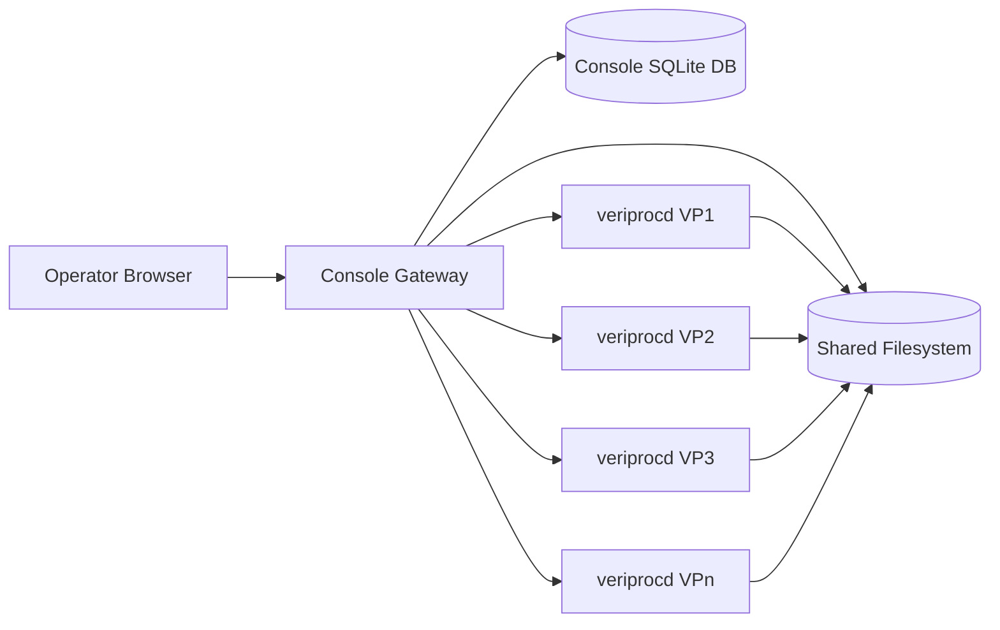

# 8. Operator Web Console and Multi-Instance Dashboard

This chapter defines an optional lightweight web application for monitoring and controlling one or more VeriProc instances through a browser. The design is intentionally close to the S4P operator view: each station is rendered as one row, active execution slots are rendered as compact boxes, and the operator can inspect and control work without direct shell access to the backend host.

Unless explicitly marked informative, statements in this chapter are normative for implementations that claim support for the operator web console.

## 8.1 Goals and Scope

The operator web console must provide the following capabilities:

- monitor several `veriprocd` instances on one page
- render one station row per station in each instance block
- render a fixed-width strip of execution boxes per station, with empty slots visible
- show per-station success and failure counters for an operator-selected time interval
- allow authorized operators to pause and unpause a station
- allow authorized operators to submit a task to a station using explicit start and end times
- allow authorized operators to cancel a running or queued run
- allow authorized operators to retry an eligible failed or cancelled task
- open a dedicated task page for a selected non-empty execution box
- browse the selected run working root and quick-view ASCII files and logs without leaving the task page

The web console is a client of the VeriProc control plane. It must not bypass the REST API by writing directly into the SQLite state store, the station configuration root, the working-root filesystem, or scheduler state. For task browsing and preview, the console gateway may read the shared filesystem directly when that access is explicitly configured; direct writes remain forbidden.

## 8.2 High-Level Architecture

The recommended deployment model has three layers:

1. a browser-based frontend
2. a lightweight web-console backend, hereafter called the **console gateway**
3. one or more upstream `veriprocd` instances

The console gateway should be implemented in Go so that deployment and operational conventions stay aligned with the rest of VeriProc. The frontend should be implemented as a lightweight single-page application.

The browser must communicate only with the console gateway. Direct browser access to upstream `veriprocd` instances should not be required.



### 8.2.1 Responsibility Split

The frontend is responsible for layout, interaction, routing, and fast refresh of already-shaped view models.

The console gateway is responsible for:

- authenticating end users
- enforcing role-based authorization
- storing operator-facing configuration and preferences
- polling or subscribing to upstream instance state
- aggregating station and run control-plane metadata from upstream APIs into UI-oriented responses
- reading working-root trees, logs, and previewable files directly from configured shared-filesystem roots
- translating operator actions into authorized upstream API calls
- auditing mutating actions initiated from the console

Each upstream `veriprocd` instance remains authoritative for its own task, run, job, artifact, and station state. The shared filesystem remains authoritative for working-root file content.

## 8.3 Recommended Technology Choices

The recommended frontend stack is:

- `Preact` with TypeScript for a React-compatible but smaller runtime
- `Vite` for fast build and local development
- `TanStack Router` for page routing
- `TanStack Query` for polling, cache invalidation, and background refresh
- plain CSS modules or scoped CSS with CSS custom properties for a lightweight visual layer

`Preact` is preferred over a larger framework because the UI is mostly a dense operational dashboard with modest client-side state and no need for a heavy component runtime.

The recommended backend stack is:

- Go `net/http` or the same HTTP routing style already used by `veriprocd`
- SQLite for console-local users, sessions, audit records, and UI preferences
- direct read-only access to the shared filesystem roots that contain run working roots
- short-lived in-memory caching for upstream polling results
- server-sent events or simple periodic polling for live dashboard refresh

WebSockets are optional. Server-sent events should be preferred if the implementation needs push semantics because the data flow is primarily server-to-client.

## 8.4 Primary User Experience

### 8.4.1 Multi-Instance Dashboard Layout

The main page must present a grid of instance blocks. A typical wide-screen layout should allow three blocks per row, for example:

```text
(VP1) (VP2) (VP3)
(VP4) (VP5) (VP6)
```

On narrower screens the grid must collapse responsively to two columns and then one column without losing core controls.

Each instance block must contain:

- instance title and health indicator
- last refresh timestamp
- a date-time picker at the top right of the instance block that selects the beginning of the statistics interval
- optional quick presets such as last 6 hours, 24 hours, 3 days, and 7 days
- a scrollable list of station rows

The selected interval means: from the selected timestamp until the current backend time. Success and failure counters in that instance block must be computed against that interval.

### 8.4.2 Station Row

Each station row must render in this logical form:

```text
Station A  [F] [C] [C] [ ] [ ] [ ] [ ] [ ] [ ] [ ] [ ] [ ]  succ fail
Station B  [R] [R] [W] [W] [W] [ ] [ ] [ ] [ ] [ ] [ ] [ ]  succ fail
```

The station label must stay fixed on the left.

The execution strip must contain a configurable number of visible slots. The default visible slot count should be `12`.

The slot semantics are:

- `[ ]` empty visible slot, rendered in neutral gray
- `[R]` running run, rendered in green
- `[W]` queued, accepted, or dispatching run, rendered in blue
- `[F]` failed runs must remain visible in red until an operator explicitly hides them from the dashboard
- `[C]` completed runs must remain visible for a configurable visibility timeout, with `30s` recommended, and must disappear from the visible strip automatically after the backend observes successful terminal completion and that timeout expires
- hiding a failed run is an operator acknowledgment action only; it must remove the run from the station row without deleting run records, logs, artifacts, or working-root content from disk

The ordering of visible slots must be deterministic. The recommended rule is:

1. currently running runs, oldest first by run start time
2. completed runs still within the configured visibility timeout, newest first by terminal timestamp
3. currently queued or accepted runs, oldest first by task creation time
4. failed or cancelled runs that are still visible because they have not been hidden by an operator, newest first by terminal timestamp
5. empty slots

If more non-empty runs exist than visible slots, the row should display an overflow badge such as `+5` rather than silently truncating the count.

The right side of the row must display two counters:

- `cnt_succ`: number of runs or tasks that reached successful completion during the selected interval
- `cnt_fail`: number of runs or tasks that reached failed or cancelled terminal state during the selected interval

The implementation must document whether the counters are task-based or run-based. Run-based counting is preferred because the dashboard is run-oriented. The reference upstream `veriprocd` station-summary capability uses run-based counting.

### 8.4.3 Station Context Menu

When the user right-clicks the station name, the console must open a context menu.

For a viewer user, the menu may show state but must not expose mutating actions.

For an operator user, the menu must offer:

- pause station
- unpause station
- submit task

Only one of pause or unpause may be enabled at a time according to current station state.

The submit flow must open a dialog with at minimum:

- station identifier, read-only
- start time
- end time
- optional force checkbox
- optional client metadata or comment field
- submit and cancel actions

The dialog should support RFC 3339 entry and a browser-native date-time control.

### 8.4.4 Task-Box Actions

Right-clicking a task box must open a context menu scoped to the represented run or task.

For an operator user:

- a running or queued run must offer `kill` or `cancel`
- a failed or cancelled terminal run must offer `retry`, which creates a new run for the underlying task
- a failed or cancelled terminal run that is currently visible on the dashboard must offer `hide from view` or equivalent acknowledgment wording
- a completed canonical run should not offer retry by default

The UI label may be `Kill` for operator familiarity, but the backend API operation should remain `cancel` because that matches existing VeriProc run-cancellation semantics.

The `hide from view` action must affect dashboard visibility only. It must not delete task records, run records, working-root files, logs, or artifacts.

Left-clicking or primary-clicking a non-empty task box must open the task detail page in a new browser tab.

## 8.5 Task Detail Page

The task detail page must contain three main panes:

1. general task and run information
2. working-root browser
3. quick-view pane

### 8.5.1 General Task and Run Information

The header must display:

- `task_id`
- current selected run reference
- station identifier
- task window start and end
- run state
- upstream instance identifier
- working-root path when access policy allows it
- links or buttons for cancel, retry, and refresh when authorized

If the task has more than one run, the page must provide a run selector. Switching runs must refresh the working-root browser and quick-view data for the selected run without leaving the page.

### 8.5.2 Working-Root Browser

The working-root browser must allow browsing only inside the selected run working root.

The browser must show at minimum:

- directories
- regular files
- file size
- modification time when known
- a file kind hint such as text, log, binary, directory, or unknown

The browser should start at the working-root top level and should make common folders such as `input`, `output`, and `logs` easy to reach.

### 8.5.3 Quick-View Pane

The quick-view pane must stay on the same page while the operator browses files.

For ASCII or UTF-8 text files, including logs, the pane must show inline content.

For non-text files, the pane should show metadata and a download action rather than attempting inline rendering.

The quick-view pane should support:

- lazy loading for large files
- line wrapping toggle
- fixed-width font
- byte-range or line-range fetch for logs larger than the inline limit

The implementation must define a maximum inline preview size. A preview limit of `1 MiB` per request is recommended.

## 8.6 Console Gateway Configuration

The console gateway must load a dedicated configuration file that defines:

- HTTP bind address and TLS settings when applicable
- the list of managed VeriProc instances
- per-instance upstream base URL and credentials reference
- per-instance shared-filesystem location or working-root base accessible to the console gateway
- dashboard defaults such as visible slot count, completed-run visibility timeout, and refresh interval
- path and migration policy for the console SQLite database
- session settings and audit-retention settings

An example configuration shape is:

```yaml
schema_version: veriproc.console/v1

http:
  bind_addr: 127.0.0.1:8090

ui:
  refresh_interval: 10s
  visible_slots_per_station: 12
  completed_visibility_timeout: 30s
  default_stats_since: 24h

db:
  dsn: file:veriproc-console.db

instances:
  - id: vp1
    label: VP1
    base_url: https://vp1.example.org/api/v1
    working_root_base: /shared/veriproc/vp1/work
    auth:
      type: bearer
      token_env: VP1_TOKEN
    time_zone: UTC
  - id: vp2
    label: VP2
    base_url: https://vp2.example.org/api/v1
    working_root_base: /shared/veriproc/vp2/work
    auth:
      type: bearer
      token_env: VP2_TOKEN
    time_zone: UTC
```

The gateway should not store upstream bearer tokens in plaintext in SQLite. Environment variables, file-backed secrets, or an external secret manager are preferred.

The gateway should have read-only access to the configured working-root bases. It should not require write access to those roots.

## 8.7 Console SQLite Data Model

The console database is distinct from the upstream VeriProc control-plane database. It must store only console-local state.

The minimum required tables are:

- `users`
- `sessions` or `api_tokens`
- `roles`
- `instance_preferences`
- `hidden_station_runs` or an equivalent acknowledgment table for failed runs hidden from the dashboard
- `audit_log`

Additional optional tables may store saved filters, column preferences, or per-user dashboard layout.

The hidden-run table must be console-local state. It should identify the target instance, station, task, and retry index, record the acting user and timestamp, and allow the dashboard renderer to suppress an acknowledged failed run without mutating upstream VeriProc state.

### 8.7.1 Users and Roles

The console must support exactly two effective user classes:

- `viewer`: may read dashboards, task pages, and logs
- `operator`: may perform all `viewer` actions plus submit, pause, unpause, cancel, retry, and hide failed runs from the dashboard

If the console gateway reuses upstream VeriProc bearer tokens, it should map the current backend role name `reader` to console role `viewer` and backend role `operator` to console role `operator`. The console gateway must ensure that a console `operator` never escalates beyond the configured upstream operator permissions.

Passwords should not be stored in plaintext. If local passwords are used, they must be salted and hashed. Token-based or SSO-backed authentication is allowed.

### 8.7.2 Audit Log

Every mutating action initiated from the console must write an audit record containing at minimum:

- timestamp
- acting user
- target instance
- action type
- target station, task, or run as applicable
- request payload summary
- outcome status

## 8.8 Dashboard-Oriented API Between Frontend and Console Gateway

The console gateway should expose UI-oriented endpoints rather than forcing the browser to assemble many upstream calls.

The minimum gateway endpoints should be:

- `GET /api/console/instances`
- `GET /api/console/instances/{instance_id}/dashboard?since=...`
- `POST /api/console/instances/{instance_id}/stations/{station_id}/pause`
- `POST /api/console/instances/{instance_id}/stations/{station_id}/unpause`
- `POST /api/console/instances/{instance_id}/stations/{station_id}/submissions`
- `POST /api/console/instances/{instance_id}/tasks/{task_id}/runs/{retry_index}/cancel`
- `POST /api/console/instances/{instance_id}/tasks/{task_id}/runs/{retry_index}/hide`
- `POST /api/console/instances/{instance_id}/tasks/{task_id}/retry`
- `GET /api/console/instances/{instance_id}/tasks/{task_id}`
- `GET /api/console/instances/{instance_id}/tasks/{task_id}/runs`
- `GET /api/console/instances/{instance_id}/tasks/{task_id}/runs/{retry_index}/tree`
- `GET /api/console/instances/{instance_id}/tasks/{task_id}/runs/{retry_index}/file?path=...`

The dashboard response should already contain station rows expanded into a UI-friendly shape, for example:

```json
{
  "instance_id": "vp1",
  "label": "VP1",
  "since": "2026-05-27T00:00:00Z",
  "generated_at": "2026-05-28T12:00:00Z",
  "stations": [
    {
      "station_id": "StationA",
      "paused": false,
      "counts": {
        "success": 41,
        "failure": 3
      },
      "slots": [
        {"kind": "running", "task_id": "task-1", "retry_index": 0},
        {"kind": "failed", "task_id": "task-9", "retry_index": 1, "hidden": false},
        {"kind": "queued", "task_id": "task-2", "retry_index": 0},
        {"kind": "empty"}
      ],
      "overflow": 5
    }
  ]
}
```

## 8.9 Required Upstream VeriProc Capabilities and Filesystem Access Boundaries

The console can reuse existing VeriProc task and run query endpoints, but the full S4P-style operator experience requires additional upstream capabilities. An implementation may place these capabilities directly in `veriprocd` or in a tightly coupled adapter layer, but they must exist somewhere authoritative.

The minimum required upstream capabilities are:

- list stations with current paused or active state
- summarize queued and running work per station
- summarize failed or cancelled runs per station together with stable task and retry identity so the console can persist hidden acknowledgments
- pause a station
- unpause a station
- retry an eligible task
- retrieve run lists for a task

The current VeriProc task API already aligns with task submission, task query, and run identity semantics, but it does not by itself define the station dashboard aggregation responses needed by this console.

Implementations should treat these upstream capabilities as a concrete `veriprocd` implementation slice, not as an informal adapter wish list. The reference implementation exposes this slice through the endpoints in Section 8.9.1. If a non-reference upstream server does not expose equivalent capabilities, they should be implemented in `veriprocd` or an authoritative adapter first and verified with automated unit tests before or alongside the console gateway rollout.

Working-root browsing and file preview are intentionally out of scope for the upstream `veriprocd` API. Those heavier filesystem operations should be implemented in the console gateway through direct shared-filesystem access.

### 8.9.1 Reference Upstream `veriprocd` API Surface

The reference `veriprocd` implementation exposes the required upstream status and control capability through the versioned REST API under `/api/v1`. A console gateway targeting this repository should consume these endpoints before adding adapter-specific alternatives.

The implemented upstream endpoints are:

- `GET /api/v1/stations`
- `GET /api/v1/stations/summary?since=...`
- `GET /api/v1/stations/{station_id}/summary?since=...`
- `POST /api/v1/stations/{station_id}/pause`
- `POST /api/v1/stations/{station_id}/unpause`
- `GET /api/v1/tasks/{task_id}/runs`

The gateway should also reuse these already-existing upstream endpoints for related actions:

- `POST /api/v1/tasks`
- `GET /api/v1/tasks/{task_id}`
- `POST /api/v1/tasks/{task_id}/retry`
- `GET /api/v1/runs` with filters such as `task_id`, `station_id`, and `state`
- `GET /api/v1/runs/{run_id}`
- `POST /api/v1/runs/{run_id}/cancel`
- `GET /api/v1/runs/{run_id}/jobs`
- `GET /api/v1/runs/{run_id}/artifacts`
- `GET /api/v1/runs/{run_id}/logs`

The reference API still exposes some run actions by internal `run_id`. The console gateway must treat `task_id` and `retry_index` as the stable console identity and may resolve the corresponding `run_id` through `GET /api/v1/tasks/{task_id}/runs` or `GET /api/v1/runs?task_id=...` before calling a run-id-scoped upstream operation.

`GET /api/v1/stations` returns an object with an `items` array. Each item contains at minimum:

- `station_id`
- `station_name`, when known
- `paused`

`GET /api/v1/stations/summary?since=...` returns an object with `since` and `items`. If `since` is omitted, the reference implementation uses a default interval beginning approximately 24 hours before request handling time. Each summary item contains:

- `station_id`
- `station_name`, when known
- `paused`
- `running_count`
- `queued_count`
- `counts.success`
- `counts.failure`
- `slots`
- `last_refresh`

`GET /api/v1/stations/{station_id}/summary?since=...` returns the same station-summary object under the `station` field, together with `since`.

Summary slot occupants returned by upstream contain:

- `kind`: one of `running`, `completed`, `queued`, or `failed`
- `run_id`, when the upstream implementation uses an internal run key
- `task_id`
- `retry_index`
- `state`
- `terminal_at`, for terminal runs when known

The upstream station summary intentionally returns only non-empty visible occupants. Empty slots, overflow badges, and console-local hidden-run suppression are presentation responsibilities of the console gateway and frontend. If the gateway needs an overflow count beyond what the upstream summary includes, it must compute that count from the summary counts plus additional upstream task/run queries or document that overflow is unavailable for the configured upstream.

The reference upstream station summary uses a visible slot limit of `12` and a completed-run visibility timeout of `30s`. The console gateway may apply a shorter presentation timeout locally. If the gateway exposes a longer completed-run visibility timeout, it must supplement the upstream summary from task/run queries or reject that configuration because the upstream summary may already have omitted aged-out completed runs.

Pause state is authoritative in upstream `veriprocd`. Pausing a station prevents dispatch of prepared `ready` runs for that station. Accepted tasks may still be admitted and prepared into queued ready runs while the station is paused, so operators can see queued work accumulate without new execution starting.

Mutating upstream station endpoints require upstream `operator` authorization when upstream authentication is enabled. Read endpoints require a valid reader or operator token when upstream authentication is enabled.

### 8.9.2 Station Summary Contract

For each station, the upstream or adapter layer must expose:

- station identifier
- paused state
- number of currently running runs
- number of currently queued or accepted tasks
- ordered list of visible slot occupants before console-local hidden-run suppression is applied
- counters for success and failure in a caller-supplied interval
- timestamp of the last authoritative refresh

The console gateway must merge this upstream station summary with its own hidden-run acknowledgment table before returning the dashboard response to the browser. Successful completed runs must remain visible only until the configured completed-run visibility timeout expires. Failed or cancelled runs must remain visible until hidden through the console acknowledgment action. Console-local hiding must never call an upstream deletion operation and must never mutate upstream run, task, artifact, log, or working-root state.

### 8.9.3 Upstream Capability Testing Requirements

The upstream `veriprocd` capabilities required by this chapter must be covered by automated unit tests and, where practical, narrow handler-level tests.

At minimum, the upstream test suite must verify:

- station listing and paused-state reporting
- station-summary aggregation for running, queued, completed-with-timeout, failed, and cancelled runs
- retry eligibility and retry endpoint behavior
- pause and unpause endpoint behavior and authorization enforcement
- run-list retrieval for a task with deterministic ordering
- stable task and retry identity in every response needed by the console

The upstream test suite must not require a live scheduler or a live browser. It should use table-driven service tests, fake stores, and narrow HTTP handler tests.

### 8.9.4 Console Gateway Filesystem Access Contract

Working-root browsing and preview in the operator web console must be implemented by the console gateway through direct filesystem access, not through upstream `veriprocd` API endpoints.

This filesystem access model must obey the following rules:

- the root path must be the selected run working root only
- path traversal outside the working root must be rejected
- symbolic links that resolve outside the working root must be rejected or clearly marked and blocked according to policy
- text preview responses must declare truncation when a file exceeds the inline limit
- binary files must not be silently decoded as text
- the console gateway should read from configured working-root bases only
- the console gateway should use read-only filesystem access for browsing and preview

## 8.10 Authorization Rules

The frontend must hide controls the current user cannot use, but the console gateway must also enforce authorization server-side.

Authorization rules are:

- `viewer` may call dashboard, task, run, tree, and file-preview endpoints
- `viewer` must not call pause, unpause, submit, cancel, retry, or hide endpoints
- `operator` may call all read endpoints and all mutating endpoints

Mutating endpoints must use CSRF protection when cookie-based sessions are used.

## 8.11 Refresh and Performance Requirements

The dashboard should feel near-real-time without creating excessive upstream load.

The recommended policy is:

- dashboard polling every `5` to `15` seconds
- task-detail refresh every `10` to `30` seconds for state metadata
- logs and file previews loaded on demand
- per-instance gateway caching with a short time-to-live, typically `2` to `5` seconds

The console gateway must degrade gracefully when one upstream instance is slow or unavailable. A failing instance block must not block rendering of healthy instances.

## 8.12 Visual Design Requirements

The UI should be visually sparse and operational rather than decorative.

Required visual properties:

- dense station rows optimized for scan speed
- high-contrast state colors with a legend available
- consistent box size across the page
- clear distinction between running, waiting, paused, degraded, and unavailable states
- keyboard-accessible menus and dialogs

The recommended base palette is:

- empty slot: neutral gray
- running slot: green
- waiting slot: blue
- completed slot: light green
- failed slot: red
- cancelled slot: amber
- paused station label or badge: orange or amber

## 8.13 Failure Handling

If an upstream instance is unreachable, its block must render as degraded with the last successful refresh time when known.

If a mutating action fails upstream, the console must show the upstream error reason when safe to expose and must record the failure in the audit log.

If a file preview fails because the file is too large, binary, or missing, the quick-view pane must display a precise reason instead of a blank pane.

## 8.14 Unit Testing Requirements

Implementations that claim support for the operator web console must include a comprehensive unit-testing suite for both the console gateway and the frontend.

The unit-testing suite must verify at minimum:

- role-based authorization for `viewer` and `operator` users on every read and mutating endpoint
- station-row aggregation and slot ordering across running, queued, completed, failed, hidden, and empty states
- automatic disappearance of completed runs after the configured visibility timeout
- persistence and suppression behavior of hidden failed runs, including restart or process-reload scenarios
- correctness of success and failure counters for arbitrary `since` timestamps
- submission-dialog request validation, including invalid or inverted start and end times
- cancel, retry, pause, unpause, and hide action dispatch behavior, including upstream success and upstream failure cases
- file-tree browsing safety, including rejection of path traversal and blocked symlink escape cases
- text-preview behavior for ASCII, UTF-8, binary, truncated, and oversized files
- task-page run switching behavior when a task has multiple runs
- cache invalidation and refresh behavior when upstream state changes between polls
- degraded-instance rendering and error propagation when one upstream instance is unavailable

### 8.14.1 Console Gateway Unit Tests

The console gateway unit tests must cover at minimum:

- configuration loading and validation for instance definitions, UI defaults, and secret references
- authentication and authorization middleware behavior for `viewer` and `operator`
- dashboard aggregation logic that merges upstream station summaries with console-local hidden-run state
- slot rendering model generation, including overflow calculation
- hide acknowledgment repository behavior, including idempotent hide requests for the same failed run
- audit-log emission for every mutating action
- upstream client adapters, including request shaping, timeout handling, and structured error mapping
- direct filesystem browsing and preview handlers with configured working-root base enforcement
- file-browser and file-preview handlers with path normalization and containment enforcement
- response serialization for dashboard, task-detail, tree, and preview endpoints

Gateway unit tests should use table-driven coverage where practical and should rely on fake upstream clients rather than live `veriprocd` instances.

The console gateway test suite may assume that the upstream capabilities described in Section 8.9 already exist and are independently unit-tested in `veriprocd`.

### 8.14.2 Frontend Unit Tests

The frontend unit tests must cover at minimum:

- instance-grid rendering for one, several, and unavailable instances
- station-row rendering for each slot kind and overflow case
- role-gated menus so `viewer` users never see mutating actions and `operator` users do
- right-click context-menu behavior on station labels and task boxes
- date-time filter state changes and dashboard refresh requests
- task-box click navigation to the task-detail page in a new tab or equivalent routed behavior
- run selector behavior on the task page
- working-root tree browsing and quick-view pane updates
- user-visible handling of upstream action failures and degraded refresh states

Frontend unit tests should use component-level tests with mocked API responses. Snapshot-only coverage is not sufficient without behavioral assertions.

### 8.14.3 Minimum Edge Cases

The unit-testing suite must include explicit coverage for the following edge cases:

- a failed run is hidden and then the dashboard is reloaded
- a completed run ages out of visibility while the dashboard remains open
- multiple failed runs for the same task but different `retry_index` values
- simultaneous running, queued, completed, and failed runs in one station row
- a hide request is repeated for an already hidden run
- an operator retries a failed task whose failed run is still visible in red
- one managed instance is unavailable while others continue to refresh normally
- preview of a log file exactly at the preview-size limit and just beyond it

### 8.14.4 Test Isolation

Unit tests must not require a live browser, a live scheduler, or a live upstream `veriprocd` process. They must run in isolation using fakes, mocks, or temporary filesystem fixtures.

Where working-root browsing or preview logic is tested, the tests must use temporary directories and explicit fixtures so containment and file-kind behavior are deterministic.

## 8.15 Implementation Phases

The recommended implementation order is:

1. upstream `veriprocd` capabilities for station summary, station control, and retry, with focused unit tests
2. viewer-only multi-instance dashboard with station rows and counters
3. console-gateway direct filesystem access for task browsing, logs, and preview, with focused unit tests
4. task detail page with run selector, directory tree, and ASCII quick-view
5. operator actions for submit, pause, unpause, cancel, and hide
6. retry support and richer operational polish such as presets, overflow badges, and SSE refresh

This ordering establishes the required upstream capability surface first, then delivers monitoring value, inspection depth, and control actions.